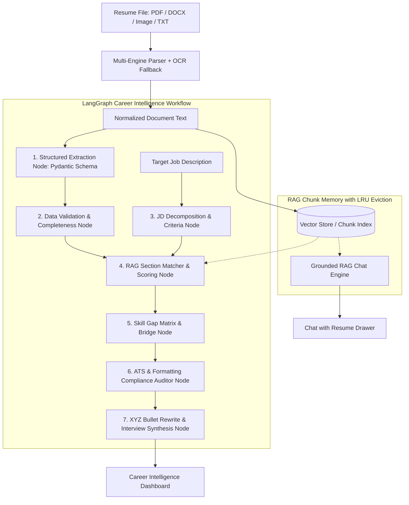

# ResumeIQ — AI-Powered Career Intelligence & Agentic CV Parser

> **Production-grade, field-agnostic career intelligence system powered by a 7-node LangGraph agentic pipeline, local RAG retrieval with grounded citations, multi-provider LLM orchestration (Groq Cloud AI + Gemini failover), and a modern "Liquid Glass" Next.js 16 frontend with dynamic light/dark themes.**

[](https://github.com/Ijlal-Hussaini/Resume_IQ)
[](https://nextjs.org)
[](https://fastapi.tiangolo.com)
[](https://langchain-ai.github.io/langgraph/)
[](https://groq.com)
[](https://tailwindcss.com)
[](LICENSE)

---

## 🎯 Product Vision & Architecture

Most "AI resume tools" are simplistic single-prompt wrappers that dump an unparsed PDF into an LLM and return generic, hallucinated advice. Furthermore, 95% of parsers assume a software engineering background and fail completely when presented with a nurse, digital marketer, accountant, civil engineer, or teacher.

**ResumeIQ** is built as an end-to-end **Agentic AI Career Intelligence Platform**:

1. **Field-Agnostic Structured Extraction**: Ingests multi-format resumes (PDF, DOCX, TXT, OCR images) and dynamically structures contact details, timeline histories, competencies, and achievements into strict Pydantic schemas without hardcoded tech taxonomies.
2. **7-Node LangGraph State Machine**: Orchestrates multi-step reasoning: data validation ➔ job description criteria decomposition ➔ semantic RAG matching ➔ critical skill gap isolation ➔ ATS compliance auditing ➔ bullet-level Google XYZ / STAR rewrites.
3. **Grounded "Chat with this Resume" RAG**: Interactive recruiter Q&A powered by local vector retrieval with **exact, clickable section citations and similarity scores** (zero hallucinations).
4. **Liquid Glass UI**: Apple/OpenAI-inspired design system with dark and high-contrast light theme support, frosted glass panels (`backdrop-filter: blur(24px)`), ambient glowing gauge, live pipeline execution telemetry, and 1-click sample evaluation presets.

---

## 🧠 LangGraph Agent State Machine



---

## 💡 Why This Project Matters (Technical Deep-Dive)

### 1. LangGraph State Machine vs. Monolithic Prompting
A single monolithic prompt attempting to parse, match, audit ATS, and rewrite bullets exhibits high token variance, fragile output schemas, and impossible error recovery. LangGraph breaks this into a **deterministic state machine**:
- Each node operates on a distinct TypedDict state with isolated responsibilities.
- Intermediate nodes (e.g. JD decomposition) produce structured artifacts that downstream nodes (RAG matching) query against.
- The UI displays the exact progress of each agent step in real-time with duration metrics in the **Pipeline Logs** tab.

### 2. Multi-Provider LLM Resilience (Groq + Gemini Failover)
In production, relying on a single free-tier LLM API introduces downtime risks from rate limits. ResumeIQ implements an **Abstracted LLM Factory**:
- **Primary**: Groq (`qwen/qwen3.8-27b` / `llama-3.3-70b-versatile`) delivers sub-second inference latency for real-time interactivity.
- **Secondary**: Google Gemini (`gemini-2.0-flash`) acts as an automated fallback if Groq returns 429 rate limit or timeout errors.
- **Local Fallback Engine**: If no API keys are configured, a smart deterministic heuristic engine ensures 100% of the UI, chat, and test suites function without onboarding friction.

### 3. Local Offline Embeddings vs. External APIs
By utilizing `sentence-transformers` (`all-MiniLM-L6-v2`) locally:
- Embeddings are generated with **zero cost** and **zero rate limits**.
- Resume data never leaves the server during vectorization.
- Fast cosine similarity retrieval enables sub-10ms citation queries for RAG chat.

### 4. True Field-Agnostic Generalization
Instead of matching skills against a static tech dictionary, the extraction prompt instructs the LLM to dynamically categorize competencies based on the candidate's natural industry. It handles:
- **Emergency Room Nurses**: Triage (ESI), Epic EHR, IV insertion, ACLS, Joint Commission compliance.
- **Growth Marketers**: CAC/LTV, ROAS, HubSpot automation, SQL attribution, SEO clusters.
- **Civil Engineers**: Finite Element Analysis, AutoCAD, OSHA safety standards, bridge rehabilitation.

---

## 🛠️ Tech Stack

| Layer | Technology | Purpose |
|---|---|---|
| **LLM Orchestration** | LangGraph & LangChain | Stateful multi-step agent graph & tool chains |
| **Primary LLM** | Groq Cloud AI (`qwen/qwen3.8-27b`) | Ultra-low latency structured extraction & scoring |
| **Fallback LLM** | Google Gemini (`gemini-2.0-flash`) | Automatic failover & resilience |
| **Structured Output** | Pydantic v2 | Strict schema validation for resumes, gaps, and ATS checks |
| **Embeddings & Vector Store** | Sentence-Transformers & Cosine Index | Local zero-cost vector chunks with LRU session eviction |
| **Document Ingestion** | `pdfplumber`, `pypdf`, `python-docx`, `pytesseract` | Multi-format text parsing with OCR fallback |
| **Backend API** | FastAPI + Uvicorn | Async typed REST API with auto OpenAPI docs |
| **Frontend Framework** | Next.js 16 (App Router) + TypeScript | Server & client components, responsive architecture |
| **Styling & Motion** | Tailwind CSS v4 + Liquid Glass Theme | Dark and high-contrast Light themes with glowing accents |
| **Deployment** | Docker & Docker Compose / Vercel + Railway | Containerized local & cloud deployments |

---

## 🚀 Quickstart Guide

### Prerequisites
- Python 3.10+
- Node.js 18+
- (Optional) Groq API Key ([Free Console](https://console.groq.com)) or Google Gemini API Key ([Free AI Studio](https://aistudio.google.com))

### 1. Clone the Repository
```bash
git clone https://github.com/Ijlal-Hussaini/Resume_IQ.git
cd Resume_IQ
```

### 2. Backend Setup
```bash
cd backend

# Create virtual environment
python -m venv venv

# Activate virtual environment
# Windows:
.\venv\Scripts\activate
# Linux/macOS:
source venv/bin/activate

# Install dependencies
pip install -r requirements.txt

# Configure environment variables
cp .env.example .env
# Add your GROQ_API_KEY to .env

# Run FastAPI server
uvicorn app.main:app --host 0.0.0.0 --port 8000 --reload
```
*Backend will be running at `http://localhost:8000`. Interactive docs at `http://localhost:8000/docs`.*

### 3. Frontend Setup
```bash
cd frontend

# Install dependencies
npm install

# Start Next.js development server
npm run dev
```
*Frontend will be running at `http://localhost:3000`.*

---

## 🧪 Automated Test Suite

ResumeIQ includes a full automated test suite verifying document parsing, structured extraction, grounded RAG citations, and full LangGraph workflow execution:

```bash
cd backend
python -m pytest tests -v
```

```text
tests/test_extractor.py::test_extract_nurse_resume_field_agnostic PASSED [ 16%]
tests/test_extractor.py::test_extract_software_resume PASSED             [ 33%]
tests/test_langgraph.py::test_full_langgraph_pipeline_execution PASSED   [ 50%]
tests/test_parser.py::test_parse_txt_file PASSED                         [ 66%]
tests/test_parser.py::test_text_normalization PASSED                     [ 83%]
tests/test_rag.py::test_rag_chunking_and_grounded_citations PASSED       [100%]
============================== 6 passed in 100% ==============================
```

---

## 📸 Key Features Walkthrough

1. **1-Click Multi-Domain Demo Personas**: Preloaded benchmark candidates (Senior AI Engineer, Trauma Nurse, Growth Lead) for instant 1-click evaluation.
2. **Multi-Format Dropzone**: Drag-and-drop PDF, DOCX, TXT, or scanned images with real-time text extraction.
3. **Real-Time LangGraph Visualizer**: Animated pipeline tracking with step connectors and execution timing.
4. **Match Dimension Scoring**: Circular animated SVG gauge with multi-dimension breakdown (Skills Match, Seniority Scope, Domain Terminology, Education).
5. **Skill Gap Matrix**: Highlights matched qualifications vs critical missing must-haves and secondary gaps.
6. **ATS Compliance Auditor**: Machine parseability rating, keyword density, and formatting check items.
7. **Google XYZ Bullet Rewrites**: Concrete before/after bullet optimization with one-click copy and recruiter rationale.
8. **Grounded RAG Chat with Section Citations**: Ask natural language questions with exact source snippets and similarity scores.
9. **Pipeline Execution Logs Tab**: Node-by-node execution logs and duration telemetry.
10. **Multi-Format Report Export**: Download findings in JSON, Markdown, and formatted HTML reports (print-to-PDF ready).

---

## 🐳 Docker Deployment

Run both backend and frontend simultaneously with Docker Compose:

```bash
docker-compose up --build
```

- Frontend: `http://localhost:3000`
- Backend API: `http://localhost:8000`

---

## 📄 License

Distributed under the MIT License. See [LICENSE](LICENSE) for more information.

---

<p align="center">
  Built with ❤️ by <a href="https://github.com/Ijlal-Hussaini">Ijlal Hussain</a>
</p>
